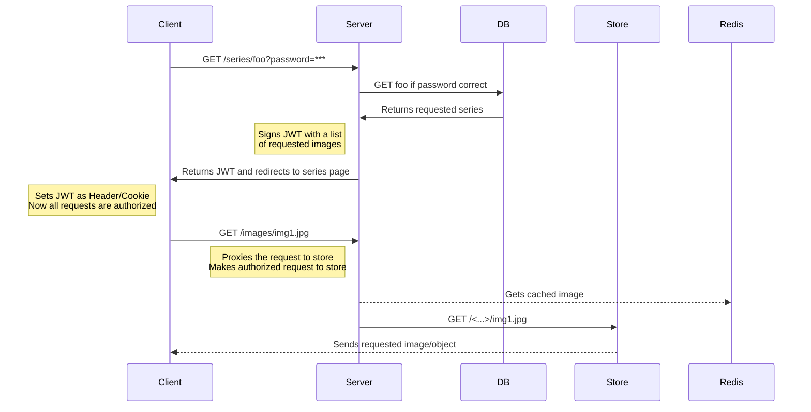

# Authentication flow

An authentication flow for a private image series

## Diagram

## Advantages

- Scalable because of cloud store
- Assets arent't stored in git repo
- JWTs prevent expensive DB calls on each image request
- No client session to manage

## Disadvantages

- Proxying results in slight latency