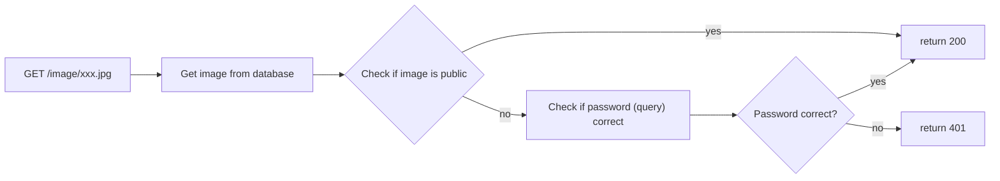

# Authentication

## Flow

```mermaid
flowchart LR
    GET["GET /image/xxx.jpg"]-->DB["Get image from database"]
    DB-->PUBLIC?{"Check if image is public"}
    PUBLIC?-->|yes|SUCCESS["return 200"]
    PUBLIC?-->|no|NO["Check if password (query) correct"]
    NO-->CORRECT?{"Password correct?"}
    CORRECT?-->|no|FAIL["return 401"]
    CORRECT?-->|yes|SUCCESS
```
