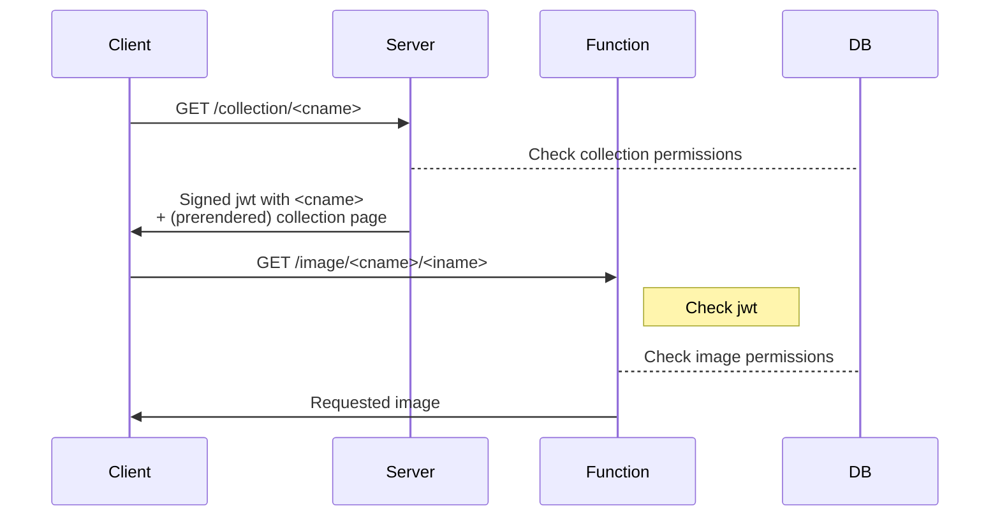

# Serverless/Stateless auth

- Token has collection name as payload
- DB can be a Mongo DB instance + redis cache

## Database Schema

```json
"collection": {
    "title": "xxx"
    "password": "******",
    "images": [
        ...
    ]
},
"image": {
    "private": true,
    "name": "xxx.jpg"
}
```

## Authentication flow



- small jwt
- low latency due to partial auth in function (no redirect)
- images get served directly (without rewrites)