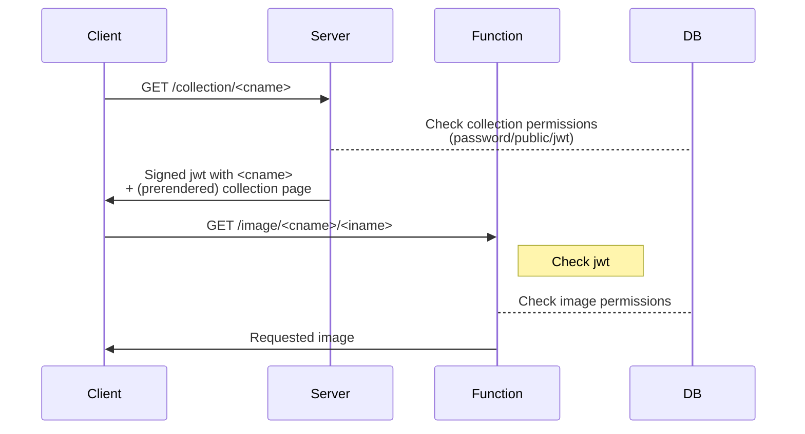
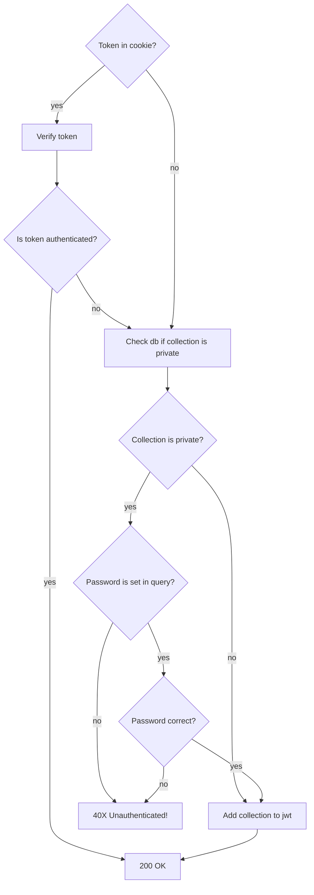

# Serverless/Stateless auth

- Token has collection name as payload
- DB can be a Mongo DB instance + redis cache

## Database Schema

```json
"collection": {
    "title": "xxx"
    "password": "******",
    "images": [
        {
            "id": 1234,
            "private": true,
            "name": "xxx.jpg",
            ...
        },
        {...}
    ]
}
```

## Authentication flow



- small jwt (only collection names needed)
- low latency due to partial auth in function (no redirect)
- images get served directly (without rewrites)

## /collection/\<cname> route


